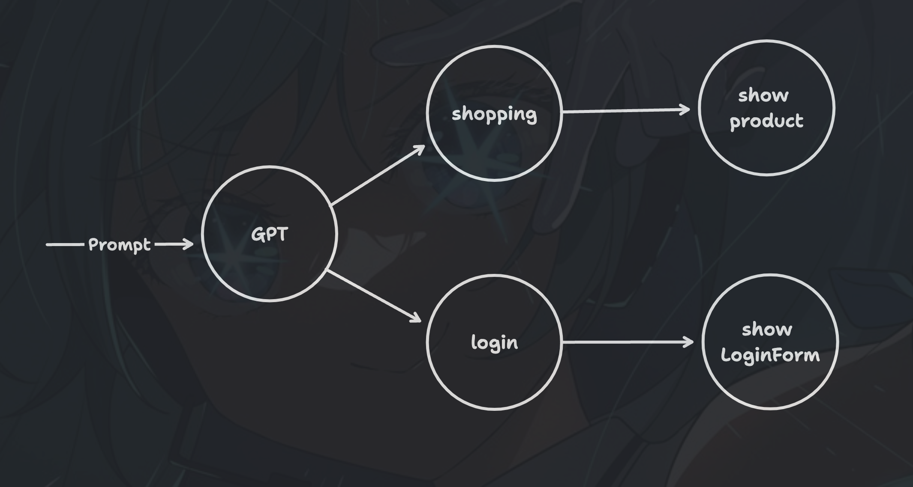

# 給前端的簡單 AI 教學 - 2.1 用 LLM 決定渲染元素

## 系列文
- [給前端的簡單 AI 教學 - 1. 連接 OpenAI](https://dev.to/shunnnet/gei-qian-duan-de-jian-dan-ai-jiao-xue-lian-jie-openai-1e93)

## 前言
上一篇文章講了怎麼取得 OpenAI API KEY，並且在網頁中打 API 連接 GPT。這一篇會講一個實際在網頁應用 GPT 的簡單範例，並且順便說明一些關於 GPT 的知識。

網路上有很多在講 LLM 的文章，大多是在說怎麼用 prompt 來生成文章，或是根據文件回答，或是自動做事情之類的。感覺跟瀏覽器端好像都沒有什麼關係。

不過其實在瀏覽器端還是有可用之處的，而且不需要很複雜的 prompt 就可以做到。

這篇文章會實作一個「**根據使用者意圖，決定要渲染什麼元素**」的小功能。



## 1. 前置作業
首先我們準備一個表單，接收訊息輸入，並且連結 OpenAI GPT。

打開網頁後，隨便輸入個訊息，就會看到 GPT 的回應在 `console`

```html
<body>
  <form id="chat">
    <textarea id="input" required></textarea>
    <button type="submit">Ask</button>
  </form>

  <script>
    const my_openai_key = '<OPENAI_KEY>'
    const input = document.getElementById("input");
    const form = document.getElementById("chat")

    // 接收表單提交
    const handleSubmit = async (e) => {
      const userMessage = input.value
      
      e.preventDefault();
      form.reset()

      const messages = [
        { role: "user", content: userMessage },
      ]
      const aiResponse = await chatCompletion(messages)
      console.log(aiResponse);
    }

    // 這個是綁表單事件
    form.addEventListener("submit", handleSubmit);

    // 連接 OpenAI GPT
    const chatCompletion = async (messages) => {
      const response = await fetch("https://api.openai.com/v1/chat/completions", {
        method: "POST",
        headers: {
          "Authorization": "Bearer " + my_openai_key,
          "Content-Type": "application/json"
        },
        body: JSON.stringify({
          model: "gpt-3.5-turbo",
          messages: messages
        })
      })
        .then(response => response.json())

      return response.choices[0].message.content
    }
  </script>
</body>
```

## 2. 判斷使用者的意圖

### temperature
前面是很基本的東西，沒有什麼特別的。

接下來我們要在 GPT 的參數中加個東西 `temperature`

```ts
// ...
const chatCompletion = async (
  messages, 
  temperature = 0 // Add this line
) => {
  // ...
    body: JSON.stringify({
      model: "gpt-3.5-turbo",
      temperature: temperature, // Add this line
      messages: messages
    })
  // ...
}
// ...
```

`temperature` 是 GPT 的一個參數，可以是 `0~1` 之間的任一個浮點數(0, 0.1, 0.2, ..., 1)。

簡單來說，GPT 在生成內容時會生成好幾個內容，並且會為每一個內容標註是正確答案的可能性。

```
內容 A, 可能性 0.81
內容 B, 可能性 0.53
內容 C, 可能性 0.51
....
```

然後他會從中選擇一個作為他的答案。

這時候，如果 `temperature` 的值越靠近 `0`，他就會比較容易做出保守的選擇，只選可能性比較高的。而越靠近 `1` 的話，他的選擇範圍就會比較廣，比較有可能選擇其他的可能性低的內容。

因為這邊我需要他穩定一點 orz，所以我設定成 `0`

### systemMessage
接著要來加 `prompt` 了。我們要加的是 `systemMessage`。

```ts
const handleSubmit = async (e) => {
  //...
  const messages = [
    // This is systemMessage
    { role: "system", content: "According to the following conversation, what is user's purpose?" },

    // conversation...
    { role: "user", content: userMessage },
  ]
  // ...
}
```

這裏我們透過 `systemMessage` 指示 GPT 「根據對話內容，分析使用者的意圖」。

`systemMessage` 也是 prompt 的一部分，他是提示 GPT 應該如何回話的「指示」。比方說，我曾經下過：

```ts
{ role: "system", content: "你是一隻皮卡丘，講話只會講「皮卡皮卡」" }
```

之類的。然後他就只會「皮卡皮卡」。

可能會有人疑惑：「我們跟網頁版 ChatGPT 說話的時候也會說出這種指示，這跟 `systemMessage` 有什麼不一樣？」。這個差異有點微妙，會在之後的文章說明。

### 查看 GPT 的回應
接著我們可以寫個內容傳給 GPT 了，在表單中填入你的訊息，按送出之後，你應該會在 `console` 看到回覆。

比方說： `請問你們有沒有賣 Mac 28 Pro ?`。GPT 是這樣回答我的：
```md
<!-- AI response -->
The user's purpose is to inquire about the availability of the Mac 28 Pro at the store.
```

回答正確，可是好像不能拿來做什麼。

### 限制 GPT 的回應
前面提到，我們可以限制 GPT 的回應方式。比方說「你只能講皮卡皮卡」。

同樣道理，我們限制他只能說出幾個答案：`shopping` 或 `login`

```ts
{ 
  role: "system", 
  content: "According to the following conversation, what is user's purpose? You must answer with one of 'shopping', 'login' " 
},
```

透過 `You must answer with one of 'shopping', 'login'` 限制他只能回答這兩個。

加上了之後，我們再試試同樣的訊息： `請問你們有沒有賣 Mac 28 Pro ?`，這次他的回應是：

```md
<!-- AI response -->
shopping
```

如果是固定選項中的常數值，那就很有用途了，比方說：根據不同的意圖，決定要顯示什麼內容。

```ts
const handleSubmit = async (e) => {
  // ...
  const messages = [
    { role: "system", content: "According to the following conversation, what is user's purpose? You must answer with one of 'shopping', 'login' " },
    { role: "user", content: userMessage },
  ]
  // Detemine user's purpose
  const aiResponse = await chatCompletion(messages)
  
  // Do something according to user's purpose
  switch (aiResponse){
    case "shopping": // purpose: shopping
      renderProducts() // show products
      break
    case "login": // purpose: login
      renderLoginForm() // show LoginForm
      break
  }
}
```

這是一個非常基礎的分類問題的 prompt。OpenAI GPT 雖然不是專門用來分類的模型，但是也具備處理這種問題的能力。

如果你喜歡，也可以加入更多的選項，比方說：'logout', 'asking question', 'contact customer service' ......。總之，透過這個 prompt，我們可以隨著聊天內容，提供使用者他需要的東西。

### 以上皆非
以上已經將基本概念講得差不多了，這裡進行一個重要的補充。

通常這種「選擇題」的 `prompt`，會加上一個「以上皆非」的選項給他。

因為我們在 `systemMessage` 中限制他只能回答 `shopping` 或 `login`。萬一使用者的意圖是以上皆非，GPT 有沒有可能會仍然回答`shopping` ？

答案是：有可能。

為了避免這種判斷錯誤的情況，通常會在最後加上一段「以上皆非」、「無法回答」時要怎麼回答的提示，比如`「若你不知道怎麼回答，請說 I don't know」`。


```ts
{ 
  role: "system", 
  content: "According to the following conversation, what is user's purpose? You must answer with one of 'shopping', 'login' with no other words. If you cannot determine, say '__no__'." 
}
```

「以上皆非」的內容根據你的需求而定。比如也可以說`「如果無法從以下對話判斷，請說 "誰知道"」`。

處理 LLM 模型回應的重點是：他有可能給出錯誤的回應，所以要記得處理這種錯誤。

```ts
switch (aiResponse){
  case "shopping": // purpose: shopping
    renderProducts() // show products
    break
  case "login": // purpose: login
    renderLoginForm() // show LoginForm
    break
  
  default: // handle __no__
    doSomething()
}
```

## 3. 回應使用者
收個尾吧。

判斷完使用者意圖了，也根據意圖顯示使用者介面了，接著我們讓 GPT 回應他吧。

在 switch 之後，再度呼叫 GPT。這次我們使用不太一樣的 prompt 與設定。

```ts
const handleSubmit = async (e) => {
  // ...
  const messages = [
    { role: "system", content: "According to the following conversation, what is user's purpose? You must answer with one of 'shopping', 'login' with no other words. If you cannot determine, just say '__no__'." },
    { role: "user", content: userMessage },
  ]
  const aiResponse = await chatCompletion(messages)

  switch (aiResponse){
    case "shopping": // purpose: shopping
      renderProducts() // show products
      break
    case "login": // purpose: login
      renderLoginForm() // show LoginForm
      break
    
    default: // handle __no__
      doSomething()
  }

  const messages2 = [
    { role: "system", content: "You are friendly customer service. Tell user we already show product him/her wants and other recommend products." },
    { role: "user", content: userMessage },
  ]

  // The chatComplete second parameter is `temperature`
  const aiResponse2 = await chatCompletion(messages2, 1)
  console.log(aiResponse2)
}
```

由於是用來回話的，所以 prompt 也不同。

首先是加上了 customer service 的角色設定。然後那句 `Tell user we already show products for him/her.` 則可以根據先前進行過什麼操作決定。

接著，注意一下，`temperature` 的設定不太相同：改成了 `1`

```ts
// The chatComplete second parameter is `temperature`
const aiResponse2 = await chatCompletion(messages2, 0.5)
```

其實設定成 `0` 也可以。但如果你希望他可以回應的多變一點，不需要那麼考慮正確性的話，這種場景，是可以考慮調高 `temperature` 的。

以下是對話與回應：

```
user: 請問你們有沒有賣 Mac 28 Pro ?
assistant: 親愛的顧客，非常感謝您的詢問！很高興告訴您，我們已經展示了 Mac 28 Pro 這款產品。如果您有任何其他問題或需要進一步了解該產品的詳細資訊，請隨時告訴我們。我們很樂意為您提供協助！
```

他也有可能說「我們沒有這個商品，但是已經為您展示了商品清單」之類的 orz。

礙於篇幅，這邊就留到之後再說怎麼改善這種情況了。

## 收尾
整理一下。這篇文章我們看到了：
- temperature 的作用：可以決定 GPT 的選擇策略要保守(0) 還是 冒險一點 (1)
- systemMessage：是 prompt 的一部分，可以用來指示 GPT 要怎麼回應。
- 簡單的分類、選擇的 prompt：我們用來判斷使用者的意圖，並做出對應的行為。

下次會講另一個在瀏覽器中應用 OpenAI GPT 的範例。

## Advertisment - Browser AI
我做 der~

Use `Browser AI` to help you build an LLM powered website!
https://courageous-manatee-a625e9.netlify.app/