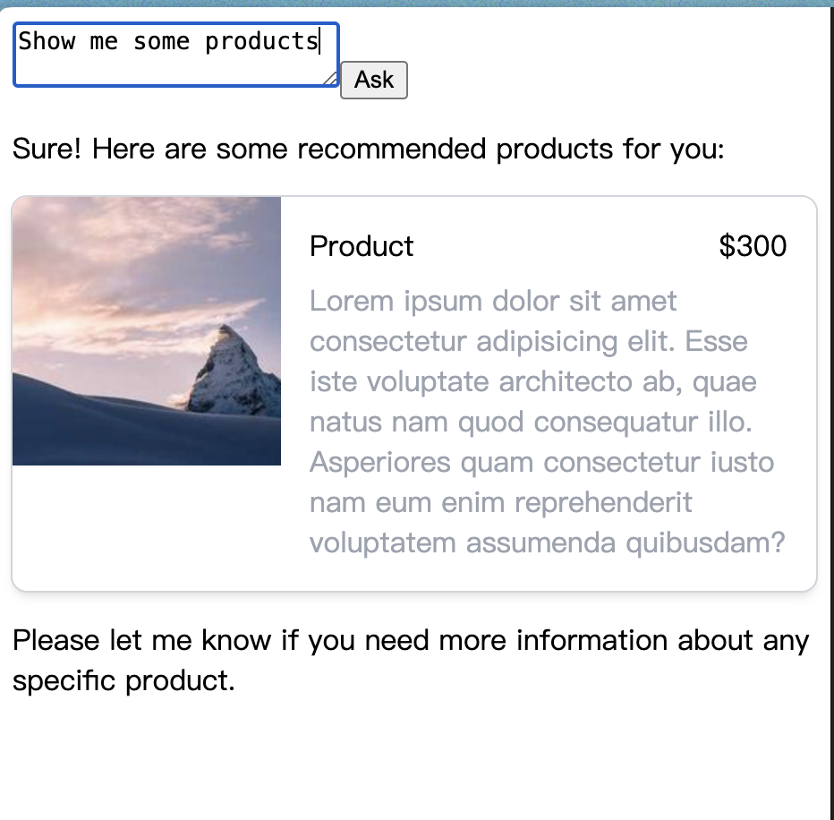

# Vue prompt component example
This is an example demonstrating how to use `Vue` to render responses from LLM (large language model). Taking `OpenAI` GPT as an example, its default response format is `Markdown`, so you can customize the rendering content using `react-markdown`. Additionally, you can request specific strings from llm through prompts and then use `@crazydos/vue-markdown` to render non-standard HTML elements into custom components.

You can also refer to the [vue-llm-rich-message](https://github.com/shunnNet/vue-llm-rich-message) repository. It has packaged this functionality into a component.

## Setup
To run this example, you need cd to this directory and install dependencies:

```sh
cd ./04-insert-component/vue-prompt-component

# npm
npm install

# pnpm
pnpm install
```

Then setup your `OPEN_AI_API_KEY` in .env

```.env
VITE_OPENAI_API_KEY=<your-open-ai-key>
```

After setup, run the command to start, and open `http://localhost:5173` in browser.
```sh
# npm
npm run dev

# pnpm 
pnpm dev
```

## Sample
You can type some message in `textarea`, e.g: `Show me some products`

You can also check the implementation in `./src/App.vue`.

